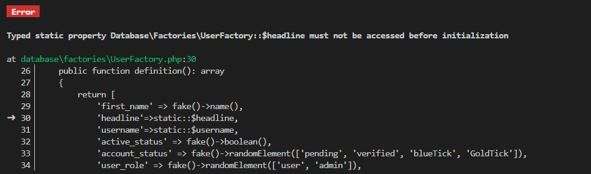
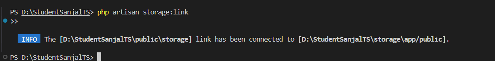

# StudentSanjal - OpenSource Project

## Day1:
> Basic Setup | Student Sanjal

> User model and other customized

> Login & Register page fixing

> Mobile UI fixing

## Day2:
> 

> ShareInertiaData => const { user } = usePage().props.auth;

> name, headline, active_status

> UpdateProfile page

> Mobile-down-navbar

## Day3
> Not ShareInertiaData [already in HandleInertiaRequest]

> update_profile fixed

> 
> npm install react-toastify
> 

## Day 4
> Post Media
> Post remove and undo mechansim
> Post user_id details

## Day 5
> Handle post_like_count

> Day.js

> Profile page updating

## Day 6
> ShowProfile -page for all users

> UpdateProfile page- css fixing

## Day 7
> Note Features
> Edit and Delete note
> Message page

## Day 8
> Modal 
> message ui and z-index fixed
> See others note

## Day 9
> Username update while loggedin in first time
> File URL | Path
> getProfileUrl

## Day 6
> storeNote updated

## Day 7
> StartChat component
> fixing without note

## Day 8
> latest_chat on null
> css fixing
> Laravel Reverb

## Day 9
> Follower & Following mechanism

## Day 10
> Follower first_name implode
> Followed user's post in Feed

## Day 11
> Event page
> CSS fixed
> Post page: for video file also
> Events in Navbar

## Day 12
> My Network max-sm: css fixing
> EventDetail

## Day 13
> Post Interaction: like
> Post Interaction: comment 

## Day 14
> PostLike upgraded
> PostComment upgraded
